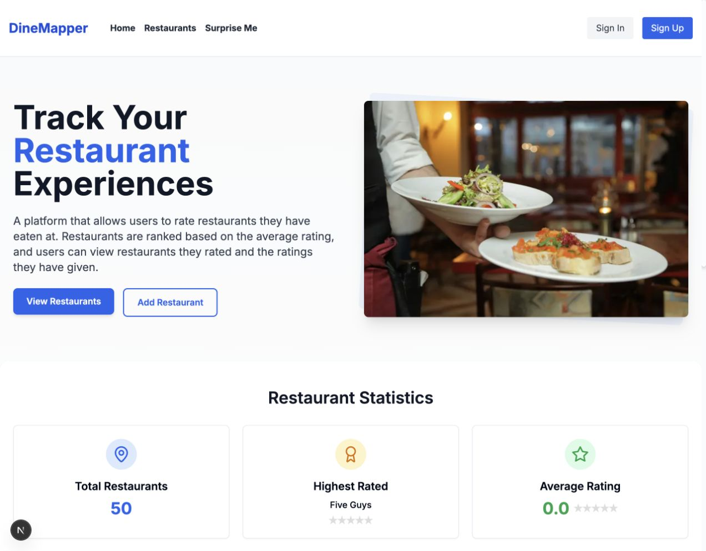
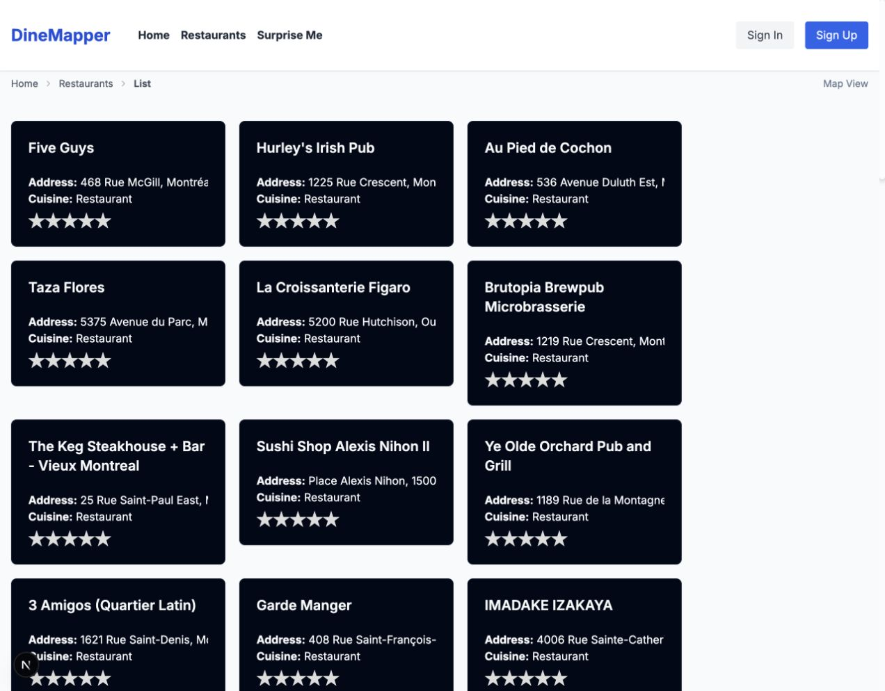
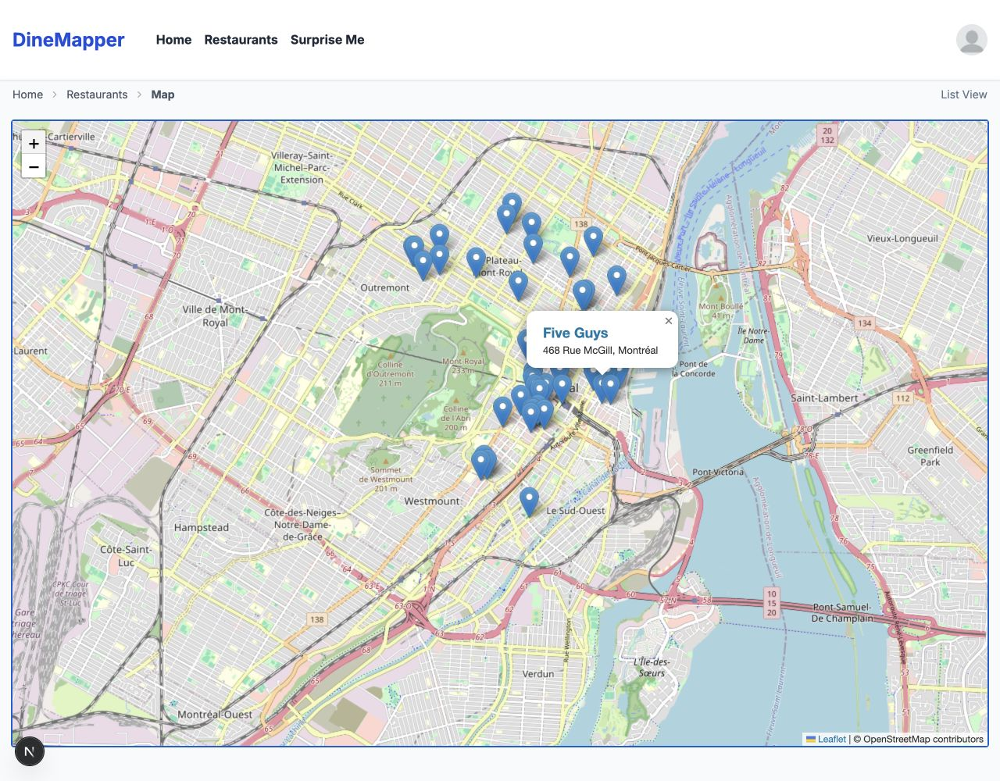
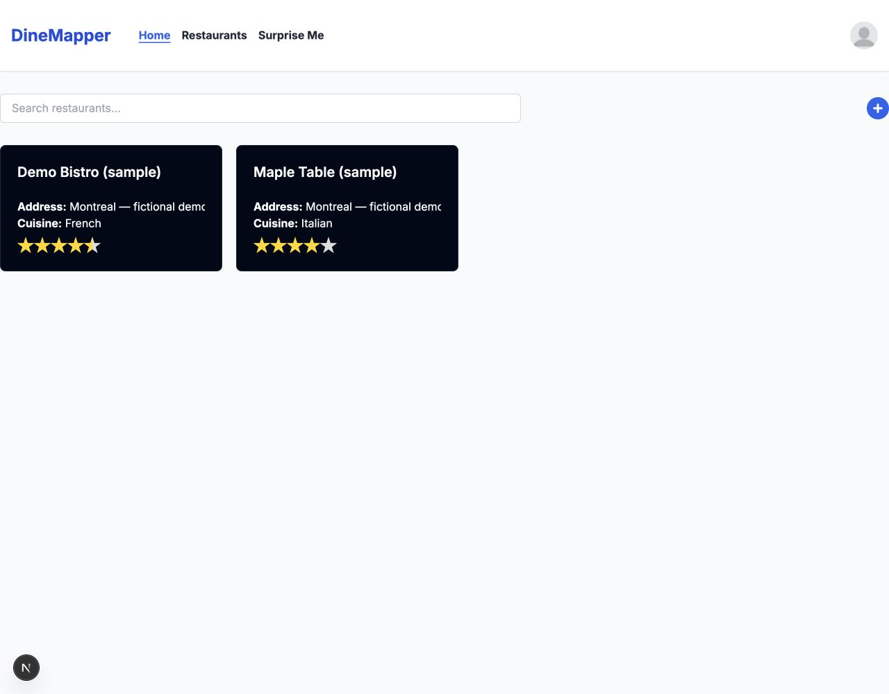
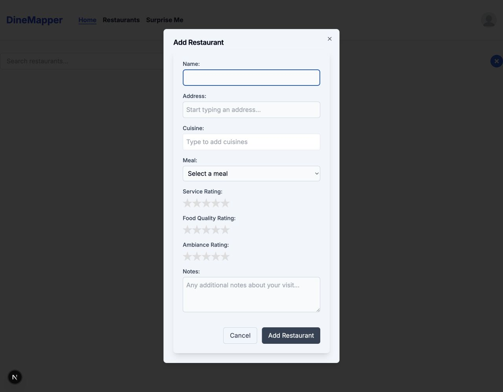
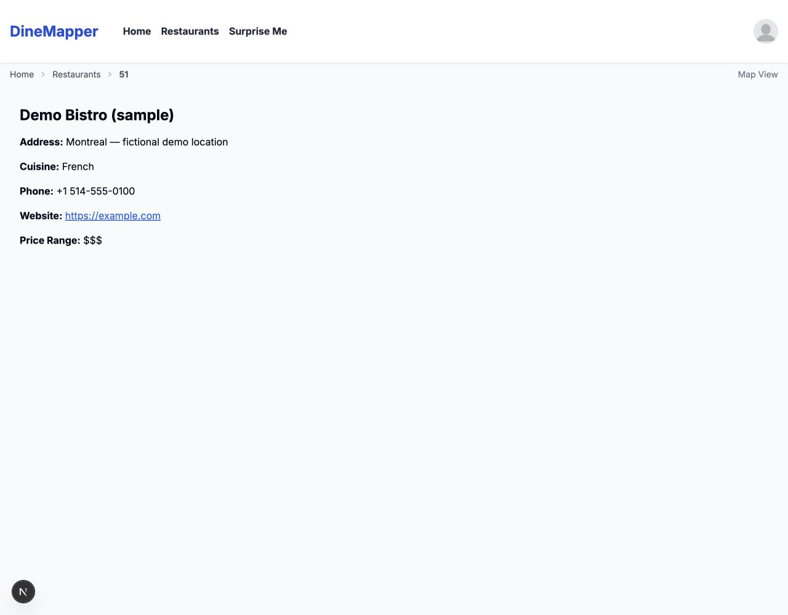
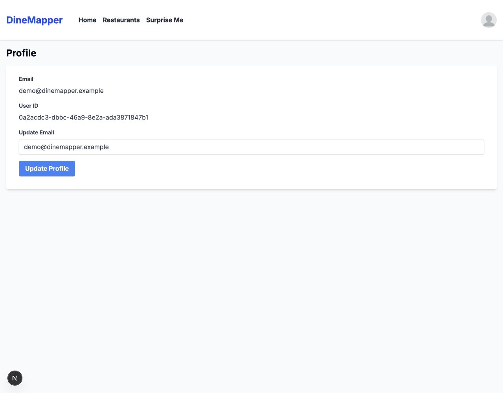
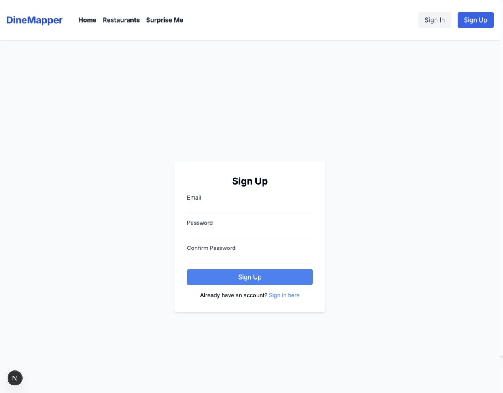
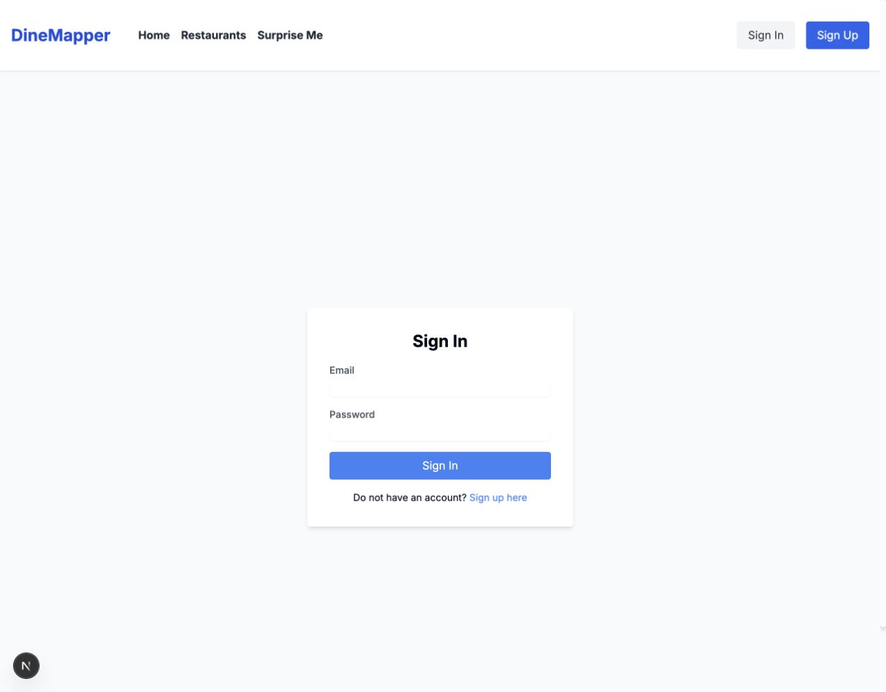
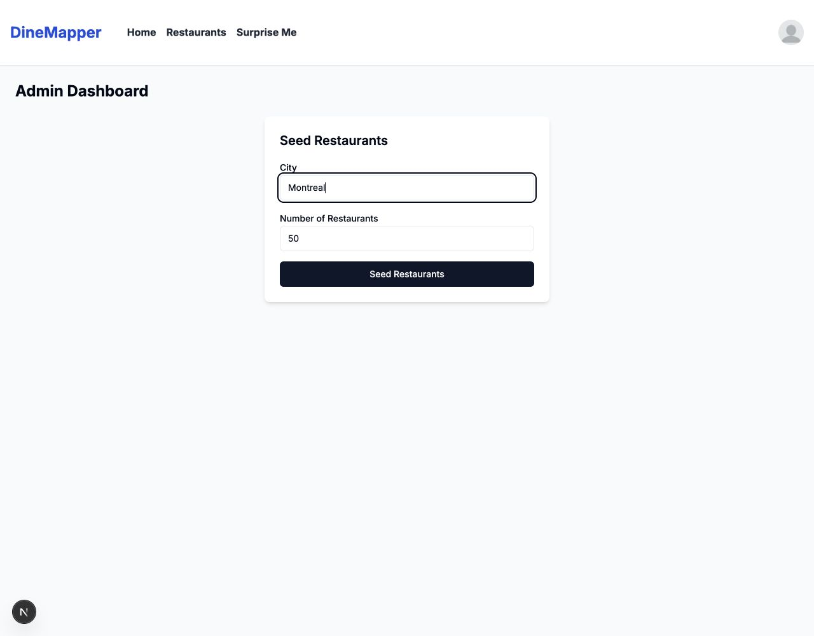

# DineMapper

### Remember where you ate. Decide where to eat next.

DineMapper is a restaurant journal and local discovery prototype for diners who want to revisit past experiences and spend less time choosing their next meal. It brings restaurant browsing, geographic context, dining feedback, and a nearby recommendation into one experience.

**Product hypothesis:** combining a personal dining history with a small, relevant set of choices can make restaurant discovery more useful than browsing an undifferentiated list. This is a hypothesis to validate—not a claim of proven engagement or business impact.

[Product walkthrough](#product-walkthrough) · [Product decisions](#product-decisions-and-tradeoffs) · [Success metrics](#how-success-would-be-measured) · [Run locally](#run-locally)

## The user problem

A diner has two related needs: “What did I think of the places I've tried?” and “Where should I go tonight?” A saved name alone does not capture the experience, and a long list of restaurants does not necessarily make the next decision easier.

DineMapper is designed for repeat local diners and people exploring a city. Its intended value is a shorter path from discovery to a decision, with food, service, and ambiance feedback that makes past visits easier to remember.

From a business perspective, the opportunity is repeat use around a recurring decision. City-level imports provide initial restaurant coverage; diner contributions could make that catalog more useful over time. Acquisition, retention, willingness to contribute, and monetization have not been validated.

## Product walkthrough

**Discover → compare → choose → record an experience → return.**

These are actual captures of the local prototype with imported Montreal listings and a dedicated demo account. The personal dashboard includes two fictional sample restaurants with seeded ratings for demonstration; these are not real restaurant reviews. Imported listings are not evidence of active users; unrated listings should not be interpreted as poor reviews. No usage or outcome metrics are claimed.

### 1. Discover: landing page

The landing page introduces the journal, summarizes the catalog, and provides entry points into browsing and contributing. Top-rated and recently added sections make restaurants accessible from the first screen.



### 2. Compare: restaurant list and map

Cards offer a scannable view of names, addresses, cuisines, and aggregate ratings. The map provides geographic context, with clickable pins that link to restaurant details.





### 3. Choose: Surprise Me

Choose a cuisine and a distance from 1–50 km, then request a suggestion. The app filters restaurants by straight-line distance and cuisine, sorts matches by aggregate rating, and randomly selects one of the top five (or all matches if fewer than five exist). The result provides the address, distance, and a link to restaurant details.

This is a rule-based recommendation, not AI or personalization based on dining history. Restaurants without aggregate ratings receive a score of zero in the ranking and remain eligible. Location access and nearby catalog coverage are required.

<!-- Successful recommendation screenshot pending capture and approval; do not substitute an error screen. -->

### 4. Record and revisit: dashboard and rating form

After sign-in, the personal dashboard lists restaurants associated with the user's ratings and supports search by name, address, or cuisine. Its **+** control opens a form for restaurant details, cuisine, meal, food quality, service, ambiance, and notes.

These screenshots show a populated demo dashboard and the form interface. The two sample entries and their ratings were seeded directly into the local database; they do not demonstrate a successful form submission. A sample save returned an error during capture; see [prototype limitations](#prototype-status-and-limitations).

| Personal dashboard | Add restaurant and ratings |
| --- | --- |
|  |  |
| Revisit rated restaurants: Demo Bistro and Maple Table are fictional examples. | Capture multiple aspects of a dining experience. |

### Supporting pages

| Restaurant details | Profile |
| --- | --- |
|  |  |
| Inspect a rated sample's restaurant information. Ratings appear on dashboard/list cards; this detail layout does not yet display them. Contact details are fictional placeholders. | View account information and access the email update control. |

| Sign up | Sign in |
| --- | --- |
|  |  |
| Create an account for the personal journal. | Return to the personal dashboard. |

<details>
<summary>Catalog operations: admin restaurant import</summary>

The admin page accepts a city and restaurant limit for Google Places import, establishing catalog coverage before users contribute. This capture shows the controls; no paid import was submitted for it.



</details>

### Page directory

These are application routes, not hosted demo links. Review the screenshots directly on GitHub without running the app.

| Page | Route | Current role |
| --- | --- | --- |
| Landing | `/` | Product introduction and catalog discovery |
| Restaurant list | `/restaurants/list` | Browse restaurant cards |
| Interactive map | `/restaurants/map` | Explore pins and open details |
| Restaurant details | `/restaurants/[id]` | Inspect one restaurant |
| Surprise Me | `/surpriseme` | Request a nearby recommendation |
| Personal dashboard | `/home` | Search rated restaurants; open the add/rating dialog |
| Standalone add page | `/restaurants/add` | Placeholder heading; the form is in the dashboard's **+** control |
| Sign up | `/signup` | Account registration |
| Sign in | `/signin` | Account authentication |
| Profile | `/profile` | Account information and email update control |
| Admin import | `/admin` | City-based catalog import controls |

## Product decisions and tradeoffs

These are interpretations of the implementation, not claims about a documented research process.

| Decision | User value | Tradeoff to validate |
| --- | --- | --- |
| List and map browsing | Support quick comparison and geographic exploration | Map usefulness depends on coordinates and a sensible starting area |
| Food, service, and ambiance ratings | Capture more context about an experience | Extra inputs may increase contribution effort |
| One suggestion from the top five matches | Reduce choices while allowing variety | Sparse ratings weaken ranking; repetition remains possible |
| Cuisine and straight-line distance filters | Offer simple, understandable controls | Distance is not travel time; imported cuisine labels can be generic |
| City catalog imports | Reduce the empty-catalog problem | Coverage alone does not provide trusted reviews or retention |

## How success would be measured

**Proposed measurement plan; analytics and results are not implemented or reported here.** Establish a baseline before setting improvement targets.

| Question | Proposed metric | Interpretation |
| --- | --- | --- |
| Does it help people decide faster? | Median time from discovery entry to a confirmed restaurant choice in a usability task | A detail-page click alone is not proof of a dining decision |
| Are suggestions useful? | Sessions opening suggested restaurant details ÷ sessions receiving a recommendation | Track empty results and location failures alongside this rate |
| Can new users contribute? | New accounts saving a first restaurant/rating within seven days ÷ new accounts | Separate form starts, validation failures, and successful saves |
| Does the journal encourage return visits? | Activated users returning for a discovery or journal action within seven days ÷ activated users | Define activation as a first successful contribution, not account creation |

## What to validate next

1. **Complete the contribution journey.** Resolve the standalone add-page gap, manual name entry, and save failure before measuring activation.
2. **Test recommendation usefulness.** Observe whether diners accept a suggestion, request another, or abandon; compare rated and unrated candidates.
3. **Reduce location friction.** Test denied permissions and out-of-coverage users; evaluate a manual city/location fallback.
4. **Improve catalog quality.** Check cuisine specificity, missing information, and local density before expanding to more cities.

## Prototype status and limitations

This is a product prototype, not a production-readiness claim. Browsing, map pins, detail pages, and demo-account sign-in were observed locally during documentation review.

- `/restaurants/add` renders a heading without the form. The form opens through **+** on `/home`, but manual name input does not update state, and a sample save returned an error in the capture environment.
- Recommendations need location access and nearby restaurants. The in-app browser could not obtain location; another browser obtained it but found no nearby matches. A successful result screenshot remains pending.
- The map falls back to London when location is unavailable, even for a Montreal catalog. The screenshot was panned to the imported listings.
- Seeded listings may have generic cuisine labels and no ratings. “Highest rated” does not establish review quality when all entries are unrated.
- Open Profile through the signed-in account menu; a direct visit can redirect during authentication loading.
- The admin import endpoint currently has no role check. Access control needs attention before public exposure.

## Technical overview

Next.js 16, React 19, TypeScript, Tailwind CSS, and Radix UI provide the application interface. PostgreSQL and Sequelize store users, restaurants, ratings, and aggregates. Authentication uses signed tokens in an HTTP-only cookie.

**Map display:** Leaflet / React Leaflet with OpenStreetMap tiles; no Google key is needed for map display. **Import and address autocomplete:** Google Places and Geocoding services.

## Run locally

Prerequisites: Node.js 20.9 or later, npm, and PostgreSQL. Google-backed import and autocomplete also require a configured Google Maps API key.

```bash
git clone https://github.com/janabjaradat/DineMapper.git
cd DineMapper
npm install
```

Create a PostgreSQL role and database, then create a private `.env` matching them:

```env
DB_USERNAME=your_postgres_role
DB_PASSWORD=your_database_password
DB_DATABASE=dinemapper
DB_HOST=127.0.0.1
DB_PORT=5432
JWT_SECRET=replace_with_a_long_random_secret
NEXT_PUBLIC_GOOGLE_MAPS_API_KEY=your_google_maps_api_key
```

```bash
npm run db:migrate
npm run dev
```

Open [localhost:3000](http://localhost:3000), or the port printed by the server. Run only one development instance per checkout. Keep `.env` out of version control.

### Optional city import

Enable the corresponding Google Places, Geocoding, and Maps JavaScript services for import and autocomplete. Import can incur Google API charges.

```bash
npx tsx src/scripts/seedRestaurants.ts Montreal
```

The CLI imports up to 50 restaurants. The `seed:restaurants` npm shortcut points at a different path; use the command above.

### Useful commands

| Command | Purpose |
| --- | --- |
| `npm run dev` | Start development server |
| `npm run build` | Create production build |
| `npm run start` | Serve production build |
| `npm run db:migrate` | Apply pending migrations |
| `npm run db:migrate:undo` | Revert latest migration |
| `npm run db:seed` | Run configured Sequelize seeders |

The configured lint script uses `next lint`, unavailable in the installed Next.js 16 CLI; do not treat it as a passing check. Database rollback/reset commands can remove data; use only on a disposable development database.

### Project structure

```text
src/app/          Pages and API routes
src/components/   Restaurant interfaces and reusable UI
src/contexts/     Browser location state
src/hooks/        Authentication state
src/lib/          Database and authentication helpers
src/models/       Sequelize models
src/scripts/      City import script
migrations/       Database migrations
docs/screenshots/ Actual product screenshots
```

## License

No license file is currently included in this repository.
